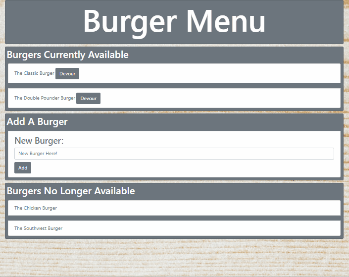
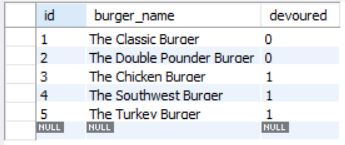

# BURGER MENU

## WHAT IS IT?

This is a database app that allows the user to manipulate a MySQL database using node.js. Using the MVC framework, a user can insert and remove burgers from an availability list.

## CLICK BELOW TO ACCESS THE SITE!

[Click here for Burger Menu](https://fathomless-shore-70165.herokuapp.com/)

*Site is hosted by Heroku

## GIF

## MySQL

This project uses a single table that allows the user to insert new burgers into the table and change the "devoured" column from false to true.

## TECHNOLOGIES APPLIED

- MVC Framework
- MySQL database
- [Heroku](www.heroku.com)
- [Bootstrap CSS](https://getbootstrap.com/)
- [node.js](https://nodejs.org/en/)
    [NPM Packages](https://www.npmjs.com/)
    - [mysql](https://www.npmjs.com/package/mysql)
    - [express](https://www.npmjs.com/package/express)
    - [body-parser](https://www.npmjs.com/package/body-parser)